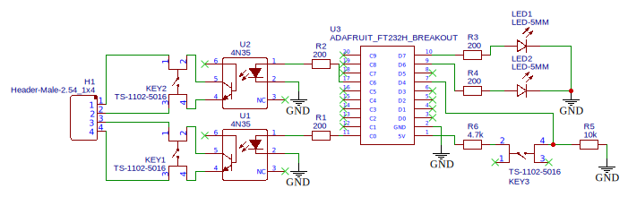

# AutoDesk

Automatic standing desk control over GPIO.

## Design

The software is built around an aiohttp server. It runs on a device with GPIO
pins which it uses to control controls the desk and it maintains the current
state (and history) in a SQLite database. The server also maintains a timer
which fires when its time to change position.

The client observes the lock/unlock events of the used computer as an activity
indicator and passes these events on to the server. The server then uses
them to calculate when to raise or lower the desk.

## Connecting to the desk

The GPIO pins are wired up to control two electrical switches (relays,
transistors, opto-couplers or something with similar function). These
electrical switches are connected to the ports of the up/down buttons on the
desk's control dongle. If your desk use a more complicated control protocol,
you have to use a different approach.

Several desks with different connectors have been tested.

### TiMOTION TC11 10P10C connector

The TiMOTION TC11 desk controller uses the following wiring with a [10P10C
connector](https://en.wikipedia.org/wiki/Modular_connector#10P10C). Wiring of
the included two-button controller as follows (counting as in the [TIA-568
table on
Wikipedia](https://en.wikipedia.org/wiki/ANSI/TIA-568#T568A_and_T568B_termination),
not including the two unused pins at either end of the connector):

| Pin | Desk connector | T568B color | Voltage | Function |
|-----|----------------|-------------|---------|----------|
| 1   | not connected  |             |         |          |
| 2   | not connected  |             |         |          |
| 3   | not connected  |             |         |          |
| 4   | white          | blue        | +5V     | down     |
| 5   | black          | white/blue  | +5V     | up       |
| 6   | brown          | green       | 0V      | common   |
| 7   | not connected  |             |         |          |
| 8   | not connected  |             |         |          |

Bridging down/up to common moves the desk accordingly.

### Unknown brand 8P8C connector (RJ45/Ethernet)

The tested desk (whose brand has since been forgotten) used the following
wiring with a [8P8C
connector](https://en.wikipedia.org/wiki/Modular_connector#8P8C), colors being
from the [T568A
standard](https://en.wikipedia.org/wiki/ANSI/TIA-568#T568A_and_T568B_termination):

    blue <-> blue/white => up
    blue <-> brown      => down

### Unknown brand 7-pin DIN connector

The tested desk (whose brand has since been forgotten) used the following
wiring for [7-pin DIN connector](https://en.wikipedia.org/wiki/DIN_connector):

    1 <-> 2 => up
    1 <-> 3 => down

(numbering clockwise male connector):

       4
     3   5
    2     6
     1   7

## Hardware controller

Below is an example schematic connecting the digital GPIO pins of a FT232H (can
also use a Raspberry Pi) with the desk controller using two `4N35`
optocouplers. Additionally, the following features are included:

  * LED to indicate that the desk is moving,
  * LED to indicate the session state,
  * override buttons for manually adjusting desk height,
  * additional input button for software features.

A PCB have been designed for the schematic above:

Schematic and PCB design created with EasyEDA and available here:
[easyeda.com/daoo/autodesk](https://easyeda.com/daoo/autodesk).

## Software

There is two parts to get this running, client and server.

### Server

The server runs on a raspberry or directly on the same PC as the client if you have
for example a [Adafruit FT232H](https://learn.adafruit.com/adafruit-ft232h-breakout/overview).
In general it needs to be a computer with access to GPIO pins.

A HTTP API for manually controlling the desk, setting the session state and
also showing some nice statistics. The client must be able to reach this API
over HTTP for the entire system to function. If running the server on a
raspberry Pi it is recommended to use SSH for security.

### Client

The client can be any computer that can make HTTP requests to set the session
state on the server. The tricky part is hooking in to the lock/unlock events.
On Linux a [pydbus](https://github.com/LEW21/pydbus) is used to listen to the
session activation events. On Windows the task scheduler can be set up to run
specific scripts on session activation events.

## Installation and setup

The program can be setup on a Windows or a Linux computer using the following
instructions. Uses [uv](https://github.com/astral-sh/uv) for project
management.

### Linux Server

Make sure `libusb` is installed using the system package manager. For example,
on Arch Linux:

    # pacman -S libusb

Use the following commands to setup and start the server (in test mode):

    $ cd ~/opt
    $ git clone https://github.com/daoo/autodesk
    $ cd autodesk
    $ uv run autodesk

### Linux Client

On Linux, run the `logger.py` script to listen for lock/unlock events via DBus.
Supply it with the URL to the session API endpoint like this (`autodesk` is the
host name of the computer running the server):

    $ uv run bin/logger.py http://autodesk/api/session

The host name could be localhost if using the previously mentioned FT232H.

### Windows Server

Before running the autodesk server the USB driver needs to be configured.
Download [Zadig](http://zadig.akeo.ie/) and use it to change the driver to
`libusbK` for the FT232H device. See [Adafruit's
guide](https://learn.adafruit.com/circuitpython-on-any-computer-with-ft232h/windows#plug-in-ft232h-and-fix-driver-with-zadig-3-4)
for more information.

Use the following commands to setup and start the server (in test mode):

    $ cd ~/opt
    $ git clone https://github.com/daoo/autodesk
    $ cd autodesk
    $ uv run autodesk

See [./bin/start-autodesk.ps1](./bin/start-autodesk.ps1) for start-up example.

### Windows Client

Use the Windows task scheduler to setup tasks that sets the session state using
the `bin/autodesk-activate.ps1` and `bin/autodesk-deactivate.ps1` scripts.
